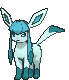

<h2 align="left">
  🌃 About Me
  
</h2>

<h6 align="left">Hi there, I'm Júlia Rebstein 👋🏻  I am an Information Systems student at UFSC (Federal University of Santa Catarina), now in my second semester.  I am focused on bridging the gap between Software Quality and Full Stack Development. My daily workflow involves automating processes and building scripts, while I expand my horizon into backend and frontend ecosystems. My long-term goal is to specialize in Cybersecurity, ensuring that the systems I build are not only functional but also resilient.  Languages: Fluent in English, native in Portuguese, and challenging myself to learn German.</h6>

###

<h2 align="left">🛠 Tech & Tools</h2>

###

<h6 align="left">Daily Drivers</h6>

###

  
  
  
  
  
  
  
  
  
  
  
  
  
  
  
  
  
  
  
  
  

###

<h6 align="left">Current Learning Path</h6>

###

  
  
  
  
  
  
  

###

<h2 align="left">📊 GitHub Stats :</h2>

###

  

###
